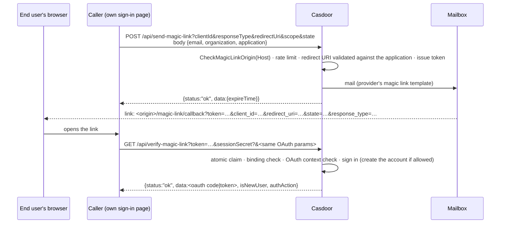

# Magic link sign-in

Casdoor supports signing in with a one-time link mailed to the user's address instead of a
password. This fork carries **two** independent ways to use it on top of the same table and the
same primitives:

1. **The built-in flow** — upstream's own addition (`object/magic_link.go`,
   `controllers/magic_link.go`), wired into the console's `LoginPage` and the standard
   `/api/send-verification-code` + `/api/login` pair. A link of this flow only works in the browser
   session that asked for it.
2. **The headless API** — a fork-only layer for a server-to-server caller that owns its own sign-in
   page and has no browser session of Casdoor's own to bind to: `POST /api/send-magic-link` /
   `GET /api/verify-magic-link`, plus an admin list/revoke/delete (`object/magic_link_{api,admin,
   permission,email,migrate}.go`, `controllers/magic_link_{api,admin}.go`).

Both flows share the `magic_link` table, the token and its hash, the atomic one-time claim, the
origin/redirect validation and the mail template substitution — the API is written as a set of
functions on top of the built-in ones (`SendMagicLinkToEmail`, `ConsumeMagicLink`,
`CheckMagicLinkSignup`, …), not a parallel implementation. See `docs/branding.md` → "Merging
upstream master into develop" → the `object/magic_link.go` row for exactly where the two touch.

## 1. The built-in flow

1. The console's sign-in page calls `POST /api/send-verification-code` with
   `method=magicLink` (`controllers/verification.go`, `form/verification.go`). The handler ties the
   link to the browser's own Beego session (`newMagicLinkSessionHash`,
   `controllers/magic_link.go`) and mails a link that points back at
   `<originFrontend>/login/<applicationName>?magicLinkToken=<token>` (`getMagicLinkUrl`,
   `object/magic_link.go`; `isValidSigninPath` only accepts `/login`, `/login/*` or `/cas/*` as the
   return path, so a caller cannot redirect the link at an arbitrary site of its own).
2. Opening the link brings the browser back to that page with `magicLinkToken` in the query. The
   page calls `POST /api/login` with `signinMethod: "Magic link"` and `code: <token>`
   (`checkMagicLinkSignin`, `controllers/magic_link.go`), which claims the link
   (`ConsumeMagicLink`) against the **same** browser session hash. A link opened in a different
   browser is rejected: `Please open the magic link in the browser you requested it from`.
3. If the user does not exist and the application's "Magic link" signin method carries the rule
   `"Sign in or sign up"` (`SigninMethodRuleMagicLinkSignup`, `object/application.go`) and the
   application allows signup at all, `addMagicLinkUser` creates the account (still subject to
   `CheckMagicLinkSignup`, an invitation code, entry-IP checks — the same gates a password signup
   goes through).

An application is offering this flow the moment `"Magic link"` is in its `signinMethods` — see
§4 "Enabling it" below; there is no separate switch for the built-in flow.

## 2. The headless API



The caller (`A`) is a frontend's own backend, not the end user's browser directly: `send-magic-link`
and `verify-magic-link` are both meant to be called server-to-server, with client credentials kept
off the browser. `verify-magic-link`'s `data` is an OAuth authorization code when
`responseType=code` was requested (the caller then exchanges it the same way it would any other
`authorization_code` grant), or a login response when `responseType=login`/absent.

## 3. API reference

All five endpoints answer the same envelope as the rest of the API:
`{"status": "ok"|"error", "msg": string, "data": ...}`. `msg` on `status:"error"` is the exact text
below; a caller that classifies errors by substring should match the constant part, not the whole
sentence (dynamic parts — an email, a redirect URI, a count — are interpolated).

### `POST /api/send-magic-link`

Body (`MagicLinkRequestForm`, `controllers/magic_link_api.go`):

```json
{
  "email": "user@example.com",
  "organization": "org",
  "application": "app-name",
  "clientId": "",
  "clientSecret": "",
  "applicationClientSecret": "",
  "group": "",
  "permission": "",
  "expiresInMinutes": 0,
  "expireTime": "",
  "captchaType": "",
  "captchaToken": "",
  "sessionSecret": ""
}
```

`application` may be omitted (the organization's default application is used). Query parameters
carry the OAuth context the link should complete after sign-in and are all optional:
`clientId`, `responseType`, `redirectUri`, `scope`, `state`, `nonce`, `code_challenge_method`,
`code_challenge`, `resource`.

**Trusted parameters.** `group`, `permission` and a custom `expiresInMinutes`/`expireTime` are only
honored when the request also proves it holds the application's own `clientId`/`clientSecret` (via
the body, `applicationClientSecret`, or the same names as query parameters) — a request that asks
for a custom TTL or a group/permission without those credentials gets `auth:Unauthorized operation`
for `group`/`permission`, or silently falls back to the application's configured TTL for
`expiresInMinutes`/`expireTime`.

Response, always `200` regardless of outcome (so the endpoint never leaks whether an address has an
account — see §6):

```json
{ "status": "ok", "data": { "expireTime": "2026-09-18T12:00:00Z" } }
```

Errors that abort the request with `status:"error"` instead of the accepted response above:

| `msg` | Cause |
|---|---|
| `check:Email is invalid` | malformed `email` |
| `general:Missing parameter` | `email` or `organization` missing |
| `check:Application does not exist` | resolving the default application of `organization` failed |
| `auth:The application: %s does not exist` | `application` set but not found |
| `auth:Unauthorized operation` | organization mismatch, `group`/`permission` requested without valid client credentials, or the OAuth `responseType`/`redirectUri` resolve to a different application |
| `verification:...` (i18n, "please set \"origin\" in conf/app.conf to send magic links") | neither `origin` nor `originFrontend` is configured and the request's `Host` is not a loopback address |
| `token:Redirect URI: %s doesn't exist in the allowed Redirect URI list` | `redirectUri` is not in the application's `redirectUris` (checked whenever `responseType` is not `"login"`, i.e. on every OAuth-continuing send) |
| `auth:The login method: login with magic link is not enabled for the application` | the application has no `"Magic link"` signin method |
| `too many magic links requested for this email\|IP\|application` | the per-application rate limit was hit |
| `you can only send one code in %ds` | the shared 60 s (default) resend throttle was hit |
| `general:Missing parameter: captchaToken.` (code `captchaRequired`) | a captcha threshold was reached and no `captchaToken` was sent |
| `verification:Turing test failed.` | captcha verification failed |
| `verification:Invalid captcha provider.` | a captcha is required but the application has none configured |

An unknown email, a disabled/deleted user, an application with signup closed, or a permission the
caller/user is not entitled to all end the same way as success: `{status:"ok", data:{expireTime}}`
with no mail sent — the outcome (and the reason) is recorded on the link's row for the admin list
(`status:"failed"`, `lastError`), never exposed to the caller.

### `GET /api/verify-magic-link`

Query: `token` (required), `sessionSecret` (required only for a `binding:"client"` link, see §5),
and the same OAuth parameters as `send-magic-link` — they must match what the link was issued with
byte for byte when the link carries an OAuth context (`responseType` other than empty/`"login"`);
a mismatch on any of them is rejected as a whole (`magic link OAuth context mismatch`), not
per-field.

Success:

```json
{
  "status": "ok",
  "data": "<oauth code, or the login response's normal data>",
  "isNewUser": false,
  "authAction": "signin_existing_user"
}
```

`authAction` is `"signup_new_user"`/`"signin_existing_user"`; `isNewUser` is the same fact as a
boolean, kept for callers that only look at one of the two.

| `msg` | Cause |
|---|---|
| `general:Missing parameter` | `token` missing |
| `magic link is invalid` | no row for this token |
| `magic link was revoked` | the link was revoked through the admin API |
| `magic link was already used` | the link's one-time claim already succeeded, or its status is not one of the still-claimable ones |
| `magic link has expired` | past its own `expireAt` (API link) or the application's verification-code TTL (built-in link) |
| `verification:Please open the magic link in the browser you requested it from` | the binding check failed: no/wrong `sessionSecret` for a `client`-bound link |
| `magic link application mismatch` | the link's application no longer matches its organization (defensive; should not occur in normal operation) |
| `magic link OAuth context mismatch` | the OAuth query parameters do not reproduce the ones the link was issued with |
| `auth:Unauthorized operation` | magic link sign-in is disabled for the application, or the address has no account and signup by link is not enabled |

A claim always resolves the link to a specific outcome (used/failed) even on an error past the
atomic claim step — a link is single-use the instant `ConsumeMagicLink`'s conditional `UPDATE`
succeeds, regardless of what happens afterwards (sign-in failing later still leaves the link
consumed).

### `GET /api/get-magic-links`

Admin list. Requires a signed-in Casdoor session with admin rights (see §7) — not a headless caller.

Query: `owner` (organization; a global admin may pass any organization or omit it to see every
organization, an organization admin's own organization is enforced regardless of what is passed),
`p`/`pageSize` for pagination (omit both for the unpaginated list), `field`/`value` for an exact
column filter, or one convenience filter among `status`, `user` (→ `requester`), `email`,
`application`, `organization` (→ `owner`), `group` (→ `subGroups`), `permission`; `sortField`,
`sortOrder`.

Response: `{"status":"ok","data":[MagicLink, ...]}` (unpaginated) or
`{"status":"ok","data":[...],"data2":<page count>}` (paginated). A row of the built-in flow, which
never sets `status`/`expiryTime` of its own, is filled in on read (`status` derived from
`isUsed`/expiry, `expiryTime` from the application's verification-code TTL) so both flows list
uniformly.

Errors: `auth:Unauthorized operation` when the caller is neither a global admin nor an organization
admin, or general request errors for a malformed page/limit.

### `POST /api/revoke-magic-link`

Query: `id` (`owner/name`, required). Marks an unused link as `is_used:true, status:"revoked"` with
the same conditional `UPDATE ... WHERE is_used = false` the one-time claim uses, so it cannot win a
race against a sign-in that already consumed the link.

Response: `{"status":"ok","data":"Affected"}` if a row was updated, `"Unaffected"` if the link was
already used/revoked or does not exist (not an error — the id may already be gone).

Errors: `general:Missing parameter` (no `id`), `auth:Unauthorized operation` (not admin, or an
organization admin targeting a link outside their own organization).

### `POST /api/delete-magic-link`

Same shape as revoke: `id` query parameter, `auth:Unauthorized operation`/`general:Missing
parameter` on the same conditions, `{"status":"ok","data":"Affected"|"Unaffected"}` on success.
Deletes the row outright (no `is_used` guard — a used or unused link can both be deleted).

## 4. Enabling it

An application offers magic link sign-in the moment `"Magic link"` is one of its `signinMethods`
(`Application.IsMagicLinkEnabled()` → `HasSigninMethod("Magic link")`). The legacy
`Application.magicLinkSigninEnabled` boolean field still exists in the schema and is still accepted
on write, but **no code path reads it any more** — it is dead weight kept only so an old dump does
not fail to load; do not gate anything on it.

The signin method's own `rule` only decides whether the **built-in** flow (§1) also treats it as a
signup method (`rule: "Sign in or sign up"`, `SigninMethodRuleMagicLinkSignup`) — it has no bearing
on the headless API, whose signup is a separate switch (§5).

## 5. Signup by link

Both flows can create the account the link was sent to, gated independently:

- **Built-in flow**: the signin method's `rule == "Sign in or sign up"` **and**
  `Application.EnableSignUp`. `addMagicLinkUser` (`controllers/magic_link.go`) then runs the same
  checks a password signup would — an entry-IP allowlist, `CheckInvitationCode` if the application
  requires one — before creating the user.
- **Headless API**: `Application.EnableMagicLinkSignup` **or** the built-in rule above
  (`IsMagicLinkApiSignupEnabled()`), independently of the method's `rule` — an application can offer
  API signup without exposing "sign up" as a rule on its console signin method at all.

Either way, `CheckMagicLinkSignup` rejects the signup outright if the application's signup page
requires a field a one-time link cannot answer (anything other than
`ID/Username/Display name/Email/Password/Confirm password/Agreement/Invitation code/Signup
button/Providers`). For the API, `GetMagicLinkSignupApplication()` additionally narrows the
application's own `signupItems`/`signinMethods` down to that same whitelist before calling the
built-in creation path, so an application whose signup page has, say, a required custom field still
signs up correctly by link (the field is simply not asked for) while a required **invitation code**
is still enforced — signup by link does not bypass it.

## 6. Fields of `Application`

| Field | JSON | Default when unset | Governs |
|---|---|---|---|
| `MagicLinkExpireMinutes` | `magicLinkExpireMinutes` | 10 | link TTL, `[2, 43200]` minutes |
| `MagicLinkPermission` | `magicLinkPermission` | — | permission a link signs in under when the request does not name one |
| `MagicLinkSigninEnabled` | `magicLinkSigninEnabled` | — | **dead**, see §4 |
| `EnableMagicLinkSignup` | `enableMagicLinkSignup` | `false` | API signup switch, see §5 |
| `MagicLinkRateLimitWindowMinutes` | `magicLinkRateLimitWindowMinutes` | 15 | rate-limit counting window |
| `MagicLinkRateLimitEmail` | `magicLinkRateLimitEmail` | 3 | links per email per window |
| `MagicLinkRateLimitIp` | `magicLinkRateLimitIp` | 10 | links per IP per window |
| `MagicLinkRateLimitApplication` | `magicLinkRateLimitApplication` | 100 | links per application per window |
| `MagicLinkCaptchaThreshold` | `magicLinkCaptchaThreshold` | 1 | links (email or IP) in the window before a captcha is required |

All counts include links of **both** flows (they share the table), so a burst through the API
throttles the built-in flow's resend for the same address and vice versa.

`Provider` (the application's Email provider) carries the mail templates:
`Content` (shared/legacy, used by the built-in flow and as the API's second fallback),
`MagicLinkContent` (API sign-in), `MagicLinkSignupContent` (API signup, used when
`authAction == "signup_new_user"`). A template wins only if it contains the literal `%link`; the
selection order (API): `MagicLinkContent`/`MagicLinkSignupContent` → `Content` → the fork's own
built-in default (branded through `CASDOOR_BRAND_*`, see `docs/branding.md`).

## 7. Binding a link to a device

`MagicLink.Binding` (empty string in the database column for the built-in flow's zero value, or one
of two more for the API) decides what `ConsumeMagicLink` checks the caller's session hash against:

| `Binding` | Set by | Checked against |
|---|---|---|
| `""` (`MagicLinkBindingSession`) | the built-in flow | the Beego session of the browser that requested the link — a link opened elsewhere is refused |
| `"none"` (`MagicLinkBindingNone`, the API's default) | `NewApiMagicLink` | a value derived only from the token itself — the link may be opened on any device |
| `"client"` (`MagicLinkBindingClient`) | `send-magic-link` when the request body carries `sessionSecret` | the SHA-256 of that same `sessionSecret`, which `verify-magic-link` must be called with again |

`sessionSecret` is meant to be a value the caller's own frontend generates and keeps in an httpOnly
cookie of its own, not something exposed to the end user — it is masked out of the audit trail (§9)
and out of `send-magic-link`'s query/body logging the same way a client secret is.

## 8. Security notes

- **Token.** 32 random bytes (`crypto/rand`), base64url-encoded; only its SHA-256 hash
  (`HashMagicLinkSecret`) is stored — the plaintext token exists only in the mailed link and in
  memory for the duration of the request that issued or claimed it.
- **One-time claim.** `ConsumeMagicLink` is a single conditional `UPDATE ... WHERE token_hash = ?
  AND is_used = false`; two concurrent requests with the same token cannot both succeed. Revoke uses
  the same pattern against the same column, so revoke and a concurrent sign-in cannot race each
  other either.
- **Origin.** The link's base URL is never taken from a request's `Host` header alone — the request
  is rejected unless `origin`/`originFrontend` is configured, or the `Host` is a loopback address
  that a forged header could not point an attacker at usefully.
- **Redirect URI.** Whenever a `send-magic-link` request carries an OAuth `responseType` other than
  `"login"`, the `redirectUri` is validated against the application's own `redirectUris` **before**
  a link is created — a caller cannot make Casdoor mail a link whose OAuth callback points anywhere
  the application was not explicitly configured to redirect to.
- **Enumeration.** `send-magic-link` always answers `{status:"ok", data:{expireTime}}` for a
  request that passes validation, whether or not the address has an account, is deleted/forbidden,
  or is blocked by a permission — the actual outcome only shows up in the admin list.
- **Signin-page path.** The built-in flow's returned link only ever points at `/login`, `/login/*`
  or `/cas/*` on the configured origin (`isValidSigninPath`) — a caller cannot redirect the mailed
  link at an arbitrary path.

## 9. Audit trail

`object/record.go`'s `NewRecord` masks magic-link secrets out of the audit table:

- `token`, `sessionSecret` and `magicLinkToken` are stripped from the logged request URI
  (`util.FilterQuery`) — a verify request's `?token=...` never appears in `request_uri`.
- `sessionSecret` in a request body is redacted to `"***"` (`isSensitiveRecordField`), the same way
  `password`/`clientSecret` are.
- A built-in sign-in's `code` (the token itself, under `signinMethod: "Magic link"`) is redacted to
  `"***"` (`maskMagicLinkSigninCode`) — that field is not caught by the generic key-based redaction
  because its key is `code`, not a name that is sensitive for every other endpoint too.
- The response body is not recorded at all outside of `buy-product`/`notify-payment` — a
  `verify-magic-link` response (which can carry an OAuth code or tokens) is never written to the
  audit table in the first place.

## 10. Database and migration

The `magic_link` table's columns are upstream's (`owner, name, created_time, application, email,
remote_addr, token_hash, session_hash, time, is_used`) plus this fork's own columns, embedded as
`MagicLinkExtension` (`xorm:"extends"`) rather than a second table: status/timestamps
(`permission, group, requester, auth_action, binding, status, expiry_time, expire_at, opened_time,
used_time, last_error`), the link's OAuth context (`client_id, response_type, redirect_uri, scope,
state, nonce, code_challenge_method, code_challenge, resource`), and a snapshot of the permission it
signs in under (`sub_users, sub_groups, sub_roles, sub_domains, resources, actions`).

A deployment whose `magic_link` table predates upstream's shape (this fork's own earlier magic link
implementation) is migrated automatically on startup, in place of a plain `Sync2`
(`object/magic_link_migrate.go`, wired in from `object/ormer.go`):

1. **`prepareLegacyMagicLinkTable`** — if the table already exists and is missing any of upstream's
   `NOT NULL` columns (`session_hash`, `time`, `is_used`), add them with a `DEFAULT` first (`ADD
   COLUMN IF NOT EXISTS` on Postgres, tolerant of two instances starting against the same database
   at once). Without a default, `Sync2` fails outright on a non-empty table
   (`contains null values`).
2. **`Sync2(new(MagicLink))`** — the ordinary upstream auto-migration adds every other new column.
3. **`migrateLegacyMagicLinks`** — in batches of 500, for every row where `time = 0 AND expire_at >
   0` (the signature of a pre-migration row: the old schema never set `time`, but always set
   `expire_at`): strip an `admin/` prefix from `application`, derive `time` from `created_time` (or
   `expire_at`, or the moment of migration as a last resort), recompute `is_used` from the old
   `status`, set `binding = "none"` and a `session_hash` derived from the token hash — so an
   unexpired legacy link continues to work exactly as an unbound API link after the upgrade.

The whole sequence is idempotent: re-running it against an already-migrated database finds no rows
matching the legacy signature and does nothing.

## 11. Conflict zones on the next upstream sync

See `docs/branding.md` → "Merging upstream master into develop" for the authoritative, kept-current
table; the magic link row there is the single place to check before resolving the next sync's
conflicts. In short: `object/magic_link.go` and `controllers/magic_link.go` are upstream's, edited
only by two comments marked `// fork:` (the embedded `MagicLinkExtension` field and the
`isMagicLinkExpired()` call inside `ConsumeMagicLink()`); everything else of this fork's own lives in
files upstream does not touch (`object/magic_link_{api,admin,permission,email,migrate}.go`,
`controllers/magic_link_{api,admin}.go`) and only calls upstream's exported functions — a rename or
re-signature of `generateMagicLinkToken`, `HashMagicLinkSecret`, `getMagicLinkOrigin`,
`getMagicLinkEmailContent`, `ConsumeMagicLink`, `CheckMagicLinkSignup` or the controller's
`addMagicLinkUser`/`getMagicLinkSessionHash` breaks the build in those fork-only files rather than
producing a merge conflict. `object/ormer.go` keeps a single non-hook edit — `a.syncMagicLink()` in
place of upstream's `Sync2(new(MagicLink))` — to run the migration of §10 ahead of the sync.
